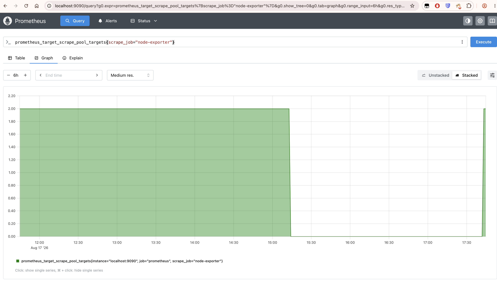
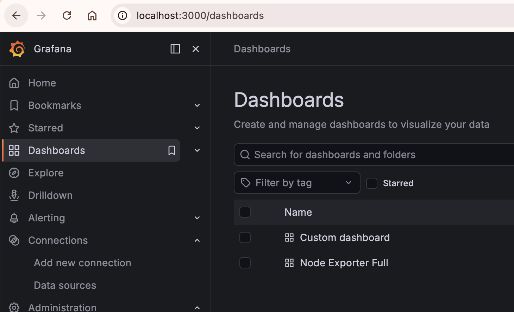
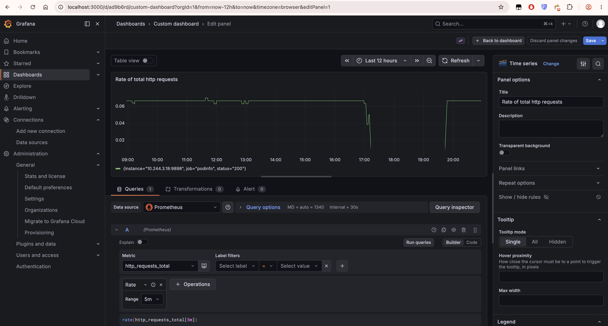
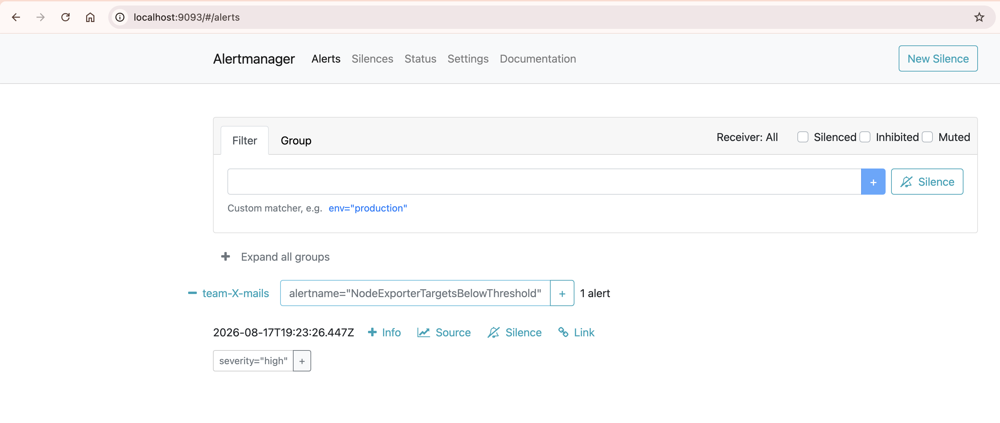

# k8s-monitoring-playground

## Developer requirements

- `pre-commit`
- `kubeconform`
- `markdownlint-cli2`
- `helm`

## Setup

`pre-commit install --install-hooks`

See `setup-env/` for Kind setup and required dependencies.

## (Optional) Setup kappa (kubectl-apply-all)

The script applies the manifests in the current dir by prefix and `.yaml`
file extension matching.

`alias kappa="kappa.sh"`

## R1 questions

This paragraph takes the questions from the R1 exercise.

### Component and workload type reasoning

<!-- markdownlint-disable MD013 -->
| Component | Workload | Reason |
| --- | --- | --- |
| Prometheus | StatefulSet | Store TSDB data between restarts |
| Alertmanager | StatefulSet | Store silences between restarts |
| Grafana | Deployment | Config is provisioned from the repo |
| kube-state-metrics | Deployment | Stateless |
| node-exporter | DaemonSet | One pod is required for each eligible node; it is stateless |
| podinfo | Deployment | Stateless |
<!-- markdownlint-enable MD013 -->

### ConfigMap and Secret

**What is the difference between ConfigMap and Secret?**

ConfigMap: non-sensitive configuration

Secret: sensitive data (passwords, tokens, private keys, etc.). Secrets are
stored Base64-encoded by default.

**When to use which?**

Use environment variables for simple values, use volume mounts for files,
structured configuration.

**What is the difference between volume and env mount?**

Environment variables are set at container startup, while mounted files can be
updated by Kubernetes. However, the application still needs to reload the file.

### Storage reclaim policies and volume access modes

**Which policy should be used in production, when, and why?**

Retain: keep the PV after the PVC is deleted. Use for data that needs to be
persisted between restarts, such as a database or Prometheus storage.

Delete: delete the PV when the PVC is deleted. Use for temporary data and
caches.

Recycle: deprecated

RWO: Read-write by one node.

ROX: Read-only by many nodes.

RWX: Read-write by many nodes.

RWOP: Read-write by one pod.

**Local volume why RWO?**

Because the storage belongs to one node and if a pod were to be rescheduled
to another node, it would not be able to access the data.

## R1 Definition of Done

This paragraph lists the DoD evidence and demonstration steps.

### Prerequisites

These steps were performed before checking against the DoDs:

- Kind cluster is running as stated in `setup-env/`
- `monitoring` namespace is created
- All component manifests in `r1-monitoring/` are applied, except for
  `r1-monitoring/pv-pvc-sc-rp-demonstration/`
- Port-forwarding is set up for Grafana and Prometheus like:

```sh
kubectl port-forward --namespace monitoring svc/grafana-service 3000:3000
kubectl port-forward --namespace monitoring svc/prometheus-service 9090:9090
```

### DoD

For consistency reasons, the DoD was translated to English.

Definition of done:

- [x] Every Prometheus target is up == 1

  ```sh
  curl -s http://localhost:9090/api/v1/targets | jq '.data.activeTargets[] | {
    endpoint: .scrapeUrl,
    labels: .labels,
    lastScrape: .lastScrape,
    health: .health
  }'
  ```

  Output:

  ```text
  {
    "endpoint": "http://10.244.1.16:8080/metrics",
    "labels": {
      "instance": "10.244.1.16:8080",
      "job": "kube-state-metrics"
    },
    "lastScrape": "2026-08-17T14:49:50.518603168Z",
    "health": "up"
  }
  {
    "endpoint": "http://10.244.3.48:9100/metrics",
    "labels": {
      "instance": "10.244.3.48:9100",
      "job": "node-exporter"
    },
    "lastScrape": "2026-08-17T14:49:48.596586292Z",
    "health": "up"
  }
  {
    "endpoint": "http://10.244.1.23:9100/metrics",
    "labels": {
      "instance": "10.244.1.23:9100",
      "job": "node-exporter"
    },
    "lastScrape": "2026-08-17T14:49:40.759009677Z",
    "health": "up"
  }
  {
    "endpoint": "http://10.244.3.18:9898/metrics",
    "labels": {
      "instance": "10.244.3.18:9898",
      "job": "podinfo"
    },
    "lastScrape": "2026-08-17T14:49:40.562475969Z",
    "health": "up"
  }
  {
    "endpoint": "http://localhost:9090/metrics",
    "labels": {
      "instance": "localhost:9090",
      "job": "prometheus"
    },
    "lastScrape": "2026-08-17T14:49:41.615578886Z",
    "health": "up"
  }
  ```

<!-- markdownlint-disable-next-line MD013 -->
- [x] Data persists after deleting the Prometheus pod (PVC + StatefulSet purpose); no state is lost after deleting the Grafana pod (Deployment + provisioning purpose)

  Prometheus:

  ```sh
  kubectl scale sts/prometheus -n monitoring --replicas=0
  # Wait to demonstrate that scraped metrics are unavailable until
  # the prometheus pod is scaled up again. (scrape_interval: 15s)
  kubectl scale sts/prometheus -n monitoring --replicas=1
  kubectl port-forward --namespace monitoring svc/prometheus-service 9090:9090
  ```

  The new pod was attached to the existing PVC:

  ```sh
  kubectl get pod -n monitoring | grep prometheus
  prometheus-0                          1/1     Running   0          15m

  # Check the age of the PVC
  kubectl get pvc | grep prometheus
  prometheus-storage-prometheus-0       Bound    pvc-e3970d2e-fcce-4843-8bbc-2c4f1090b4fd   1Gi        RWO            standard       <unset>                 6d9h

  # Check the existing PVC got bound to the new pod
  kubectl describe pvc prometheus-storage-prometheus-0 | grep "Used By"
  Used By:       prometheus-0
  ```

  The `prometheus_target_scrape_pool_targets{scrape_job="node-exporter"}`
  metrics are present after scaling up the Prometheus StatefulSet.
  

  Grafana:

  ```sh
  kubectl scale deploy/grafana -n monitoring --replicas=0
  kubectl scale deploy/grafana -n monitoring --replicas=1
  kubectl port-forward --namespace monitoring svc/grafana-service 3000:3000
  ```

  The dashboards persisted in the ConfigMap are present after scaling up.
  

<!-- markdownlint-disable-next-line MD013 -->
- [x] node-exporter runs on both workers, but not necessarily on the control plane (DaemonSet + tolerations/scheduling)

  As expected, the node-exporter DaemonSet scheduled exactly one node-exporter
  pod to each worker node.

  ```sh
  kubectl get pods -o wide -n monitoring | grep node-exporter
  node-exporter-d9btx                   1/1     Running   0          6h55m   10.244.3.48   kind-worker    <none>           <none>
  node-exporter-nq9px                   1/1     Running   0          6h55m   10.244.1.23   kind-worker2   <none>           <none>

  kubectl get nodes
  NAME                 STATUS   ROLES           AGE   VERSION
  kind-control-plane   Ready    control-plane   13d   v1.36.1
  kind-worker          Ready    <none>          13d   v1.36.1
  kind-worker2         Ready    <none>          13d   v1.36.1
  ```

  No node-exporter pod was scheduled on the control plane because it has a
  `NoSchedule` taint and the DaemonSet does not define a matching toleration.

  ```sh
  kubectl describe node kind-control-plane | grep Taints
  Taints:             node-role.kubernetes.io/control-plane:NoSchedule
  ```

<!-- markdownlint-disable-next-line MD013 -->
- [x] Prometheus/Alertmanager PVCs use dynamically provisioned PVs; kubectl get pv,pvc shows Bound status and the complete StorageClass -> PV -> PVC chain

  ```sh
  kubectl get pvc,pv
  NAME                                                        STATUS   VOLUME                                     CAPACITY   ACCESS MODES   STORAGECLASS   VOLUMEATTRIBUTESCLASS   AGE
  persistentvolumeclaim/alertmanager-storage-alertmanager-0   Bound    pvc-fa6971a8-a58c-4d71-afaa-4efcb069b93b   1Gi        RWO            standard       <unset>                 7d23h
  persistentvolumeclaim/prometheus-storage-prometheus-0       Bound    pvc-e3970d2e-fcce-4843-8bbc-2c4f1090b4fd   1Gi        RWO            standard       <unset>                 6d10h

  NAME                                                        CAPACITY   ACCESS MODES   RECLAIM POLICY   STATUS   CLAIM                                            STORAGECLASS   VOLUMEATTRIBUTESCLASS   REASON   AGE
  persistentvolume/pvc-e3970d2e-fcce-4843-8bbc-2c4f1090b4fd   1Gi        RWO            Delete           Bound    monitoring/prometheus-storage-prometheus-0       standard       <unset>                          6d10h
  persistentvolume/pvc-fa6971a8-a58c-4d71-afaa-4efcb069b93b   1Gi        RWO            Delete           Bound    monitoring/alertmanager-storage-alertmanager-0   standard       <unset>                          7d23h
  ```

<!-- markdownlint-disable-next-line MD013 -->
- [x] A manually created PV + PVC is bound without a StorageClass (Bound), demonstrating understanding of access modes

  See together with below item.

<!-- markdownlint-disable-next-line MD013 -->
- [x] A custom StorageClass uses reclaimPolicy: Retain; after deleting the PVC, the PV is Released and the data remains; the difference compared with Delete is documented

  **Retain** case:

  Create a PV and PVC manually without a StorageClass. Verify that the PVC
  reaches `Bound`. The access mode is `RWO` because the PV uses `hostPath`
  storage.

  ```sh
  cd r1-monitoring/pv-pvc-sc-rp-demonstration/
  kubectl apply -f example-pv.yaml
  kubectl apply -f example-pvc.yaml

  kubectl get pvc -n monitoring
  NAME          STATUS   VOLUME       CAPACITY   ACCESS MODES   STORAGECLASS   VOLUMEATTRIBUTESCLASS   AGE
  example-pvc   Bound    example-pv   1Gi        RWO                           <unset>                 7m30s
 
  kubectl get pv
  NAME         CAPACITY   ACCESS MODES   RECLAIM POLICY   STATUS   CLAIM                    STORAGECLASS   VOLUMEATTRIBUTESCLASS   REASON   AGE
  example-pv   1Gi        RWO            Retain           Bound    monitoring/example-pvc                  <unset>                          12m
  ```

  Apply the example StatefulSet.

  ```sh
  kubectl apply -f example-sts.yaml
  ```

  Note the below part in the StatefulSet is responsible for mounting the
  manually created PVC.

  ```text
          volumeMounts:
            - name: example-pv
              mountPath: /mnt/data
      volumes:
        - name: example-pv
          persistentVolumeClaim:
            claimName: example-pvc
  ```

  After applying the StatefulSet, we can see that the PVC was mounted by the
  pod.

  ```sh
  kubectl describe pvc example-pvc -n monitoring | grep "Used By"
  Used By:       example-sts-0
  ```

  Create a file in the pod.

  ```sh
  /mnt/data # echo "persist" > file.txt

  /mnt/data # ls -lah
  total 12K
  drwxr-xrwx    2 root     root        4.0K Aug 18 17:32 .
  drwxr-xr-x    3 root     root        4.0K Aug 18 17:32 ..
  -rw-r--r--    1 root     root           8 Aug 18 17:32 file.txt
  ```

  Delete the pod and the PVC and then the PV.

  ```sh
  kubectl delete pod example-sts-0 -n monitoring
  kubectl delete pvc example-pvc -n monitoring

  # Note the PV is in Released state
  kubectl get pv
  NAME         CAPACITY   ACCESS MODES   RECLAIM POLICY   STATUS     CLAIM                    STORAGECLASS   VOLUMEATTRIBUTESCLASS   REASON   AGE
  example-pv   1Gi        RWO            Retain           Released   monitoring/example-pvc                  <unset>                          2m46s

  kubectl delete pv example-pv
  ```

  The data is still present on the worker-node.

  ```sh
  docker exec -it kind-worker cat /mnt/data/file.txt
  persist
  ```

  Re-apply again the PV and PVC.

  ```sh
  kubectl apply -f example-pv.yaml
  kubectl apply -f example-pvc.yaml
  ```

  The pod got scheduled to the same node (RWO) and the data is still present.

  ```sh
  /mnt/data # cat file.txt
  persist
  ```

  **Delete** case:

  Apply the required manifests.

  ```sh
  # Reference the standard StorageClass that sets the Delete reclaim policy.
  kubectl apply -f example-pvc-standard-sc.yaml
  # Note this also created the PV
  # apply the same StatefulSet as before, but reference the PVC with standard StorageClass
  kubectl apply -f example-sts-delete-rc.yaml

  kubectl get pvc,pv
  NAME                                            STATUS   VOLUME                                     CAPACITY   ACCESS MODES   STORAGECLASS   VOLUMEATTRIBUTESCLASS   AGE
  persistentvolumeclaim/example-pvc-standard-sc   Bound    pvc-13b6bcbc-445a-42ce-beda-deca39aaae9a   1Gi        RWO            standard       <unset>                 74s

  NAME                                                        CAPACITY   ACCESS MODES   RECLAIM POLICY   STATUS   CLAIM                                STORAGECLASS   VOLUMEATTRIBUTESCLASS   REASON   AGE
  persistentvolume/pvc-13b6bcbc-445a-42ce-beda-deca39aaae9a   1Gi        RWO            Delete           Bound    monitoring/example-pvc-standard-sc   standard       <unset>                          71s
  ```

  Save some data in the pod.

  ```sh
  /mnt/data # echo "this will not persist" > file2.txt
  ```

  Delete the PVC and the pod.

  ```sh
  kubectl delete pvc example-pvc-standard-sc -n monitoring
  kubectl delete pod example-sts-delete-rc-0 -n monitoring
  # the PV got deleted as well
  ```

  The data is not present on the worker-node.

  ```sh
  docker exec -it kind-worker ls -lah /mnt/data/
  total 8.0K
  drwxr-xrwx 2 root root 4.0K Aug 18 18:45 .
  drwxr-xr-x 1 root root 4.0K Aug  3 19:20 ..
  ```

  **Summary**: The difference between Retain and Delete is that Retain keeps
  the PV after the PVC is deleted. Also in case of Retain and hostPath, if the
  PV is deleted, the data is still present on the worker-node.

<!-- markdownlint-disable-next-line MD013 -->
- [x] prometheus.yml is mounted as a ConfigMap volume; alertmanager.yml is mounted as a Secret volume; the Grafana admin password is provided as a Secret environment variable; the datasource and dashboard come from ConfigMaps, and the node dashboard works

  This was demonstrated in the previous steps, where the Prometheus StatefulSet
  and Grafana Deployment after scaling up had the same config and dashboards.
  The config files, password and dashboards were consumed as stated by the DoD.

- [x] kube_* metrics can be queried through kube-state-metrics

  At the time of this check, Prometheus exposed 108 distinct `kube_*` metric
  names. This number can change with the Kubernetes resources and collectors
  enabled in kube-state-metrics.

  ```sh
  curl -sG http://localhost:9090/api/v1/query \
  --data-urlencode 'query=count by (__name__) ({__name__=~"kube_.*"})' \
  | jq '.data.result[].metric.__name__' | wc -l
     108
  ```

  The kube-state-metrics ServiceAccount requires `list` and `watch` permissions
  for the Kubernetes resources it scrapes. The current ClusterRole grants only
  a subset of those permissions because no specific resource requirements were
  stated, so the kube-state-metrics pod reports errors for resources without the
  corresponding RBAC permissions, such as:

  ```text
  Failed to watch" err="failed to list *v1.PodDisruptionBudget: poddisruptionbudgets.policy is forbidden: User \"system:serviceaccount:monitoring:kube-state-metrics-sa\" cannot list resource
  \"poddisruptionbudgets\" in API group \"policy\" at the cluster scope
  ```

<!-- markdownlint-disable-next-line MD013 -->
- [x] podinfo is scraped as an application target, with a custom PromQL panel for its custom metrics

  See the previous evidence of scraping podinfo and persisting dashboards between
  restarts.

  

- [x] One alert rule reaches the firing state in the Alertmanager UI

  ```sh
  # Trigger the alert
  kubectl delete daemonset/node-exporter -n monitoring
  kubectl port-forward --namespace monitoring svc/alertmanager-service 9093:9093
  ```

  

<!-- markdownlint-disable-next-line MD013 -->
- [x] The transition from static_configs to kubernetes_sd_configs is complete, including RBAC; new targets appear automatically

  ```sh
  # By default 1 podinfo target is scraped.
  curl -s http://localhost:9090/api/v1/targets \
  | jq '[.data.activeTargets[] | select(.labels.job == "podinfo")] | length'
  1

  # Scale podinfo deployment to 3 replicas
  kubectl scale deployment/podinfo --replicas=3 -n monitoring

  # After scaling, the targets are automatically discovered and scraped by Prometheus
  curl -s http://localhost:9090/api/v1/targets \
  | jq '[.data.activeTargets[] | select(.labels.job == "podinfo")] | length'
  3
  ```

- [x] prometheus.yml can be successfully reloaded manually after a ConfigMap change

  ```sh
  kubectl port-forward -n monitoring svc/prometheus-service 9090:9090

  # Take current scrape_interval as reference
  curl -s http://localhost:9090/api/v1/status/config \
  | jq -r '.data.yaml' \
  | grep -A1 '^global:'
  global:
    scrape_interval: 15s

  # Change the scrape interval to 30s
  kubectl edit configmap prometheus-configmap -n monitoring

  # Reload the config
  curl -X POST http://localhost:9090/-/reload

  # Check the new scrape interval is applied
  curl -s http://localhost:9090/api/v1/status/config \
  | jq -r '.data.yaml' \
  | grep -A1 '^global:'
  global:
    scrape_interval: 30s
  ```
